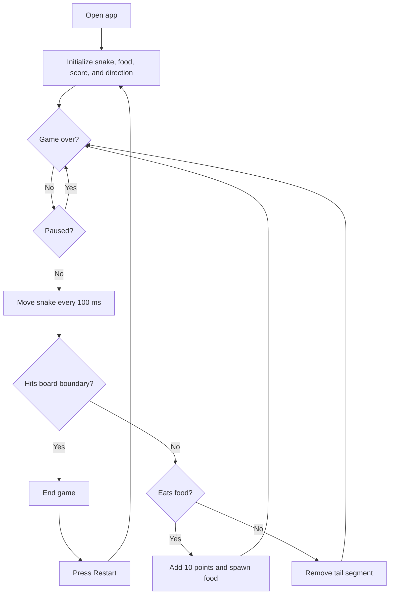
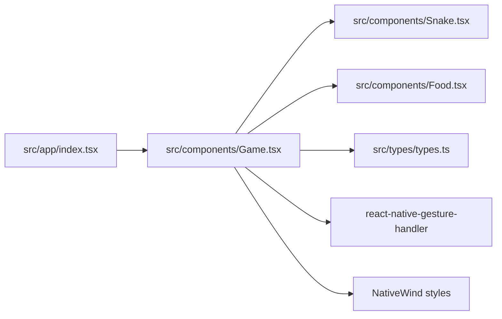

<h1 align="center">Snake Game</h1>

<p align="center">
	A simple swipe-controlled Snake game built with Expo and React Native.
</p>

<p align="center">
	
	
	
	
</p>

## Screen

The game screen contains the current score, a restart action, and a bordered board with a blue snake and red food.

```text
┌──────────────────────────────┐
│           Game Screen        │
│             Score            │
│           [Restart]           │
│                              │
│        ┌──────────────┐      │
│        │              │      │
│        │  ● ● ●   ●   │      │  Blue: snake
│        │              │      │  Red: food
│        │              │      │
│        └──────────────┘      │
└──────────────────────────────┘
```

## Features

- Swipe in four directions to control the snake.
- The snake moves continuously at a 100 ms interval.
- Eating food increases the score by 10 points and places new food randomly.
- The game ends when the snake leaves the board.
- Restart returns the snake, food, direction, score, and game state to their defaults.

## Getting Started

### Prerequisites

- Node.js
- pnpm
- An Expo-compatible device, simulator, or web browser

### Installation

```bash
pnpm install
```

### Run the project

```bash
# Start the Expo development server
pnpm start

# Open a platform directly
pnpm ios
pnpm android
pnpm web
```

## Controls

On a touch device, swipe across the board to change direction:

| Gesture     | Direction |
| ----------- | --------- |
| Swipe up    | Up        |
| Swipe down  | Down      |
| Swipe left  | Left      |
| Swipe right | Right     |

## Game Flow



## Architecture



The `Game` component owns movement, collision detection, score, food placement, and restart state. `Snake` and `Food` are presentational components that render coordinates on the board.

## Project Structure

```text
src/
├── app/
│   ├── _layout.tsx       # Expo Router layout
│   └── index.tsx         # Application entry screen
├── components/
│   ├── Food.tsx          # Food renderer
│   ├── Game.tsx          # Game state and rules
│   └── Snake.tsx         # Snake renderer
└── types/
		└── types.ts          # Shared game types
```

## Scripts

| Command        | Description                       |
| -------------- | --------------------------------- |
| `pnpm start`   | Start the Expo development server |
| `pnpm ios`     | Run the app on iOS                |
| `pnpm android` | Run the app on Android            |
| `pnpm web`     | Run the app in a browser          |
| `pnpm lint`    | Run Expo linting                  |

## License

This project is licensed under the MIT License. See [LICENSE](LICENSE) for details.
